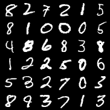
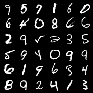
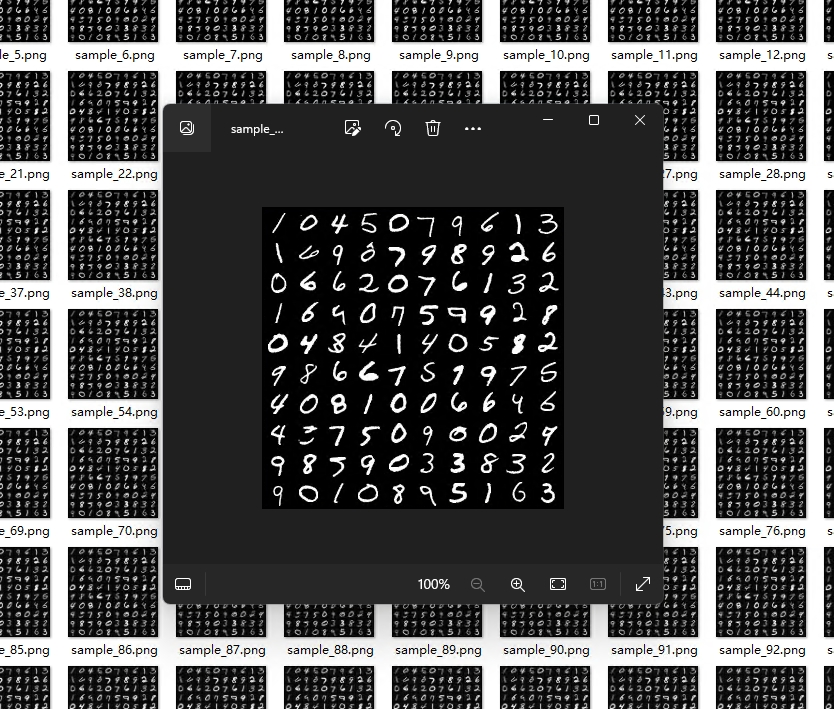

<h1> 淡蓝小点直播系列：DDPM原理推导及代码实现 </h1>

## 关于DDPM的直播
Diffusion扩散算法几乎是当前最流行的图像生成算法，DDPM及其变种被广泛的应用于图像生成、视频生成、NLP、计算机视觉等各个技术领域。

本次直播将详细介绍DDPM的数学原理并一步步对计算过程做推导。然后介绍如何用python基于pytorch实现一个简易版的DDPM。整个模型基于有4个注意力头的U-net，总参数量约1000万（即0.01B），在RTX 4090上训练时长约30分钟。

代码实现主要参考：https://github.com/explainingai-code/DDPM-Pytorch

## 直播时间
本次直播已完成，感兴趣的朋友可以查看录相回放
- 第1场：DDPM背景简介及原理推导 2024.4.3 19：30 时长约90分钟 回看地址：https://deilm.xetlk.com/sl/1r8bQX
- 第2场：Python代码实现 2024.4.4 14：30 时长约90分钟 回看地址：https://deilm.xetlk.com/sl/2uI03w
- 第3场：Python代码实现2 2024.4.4 19：30 时长约120分钟 回看地址：https://deilm.xetlk.com/sl/4tehIJ

## 最终实现
以MNIST为训练数据，训练出一个生成0~9的手写数字体的扩散模型。训练数据是一张张的手写数字体，为了便于观察将多张合并之后如下所示（训练时一个单独的数字照片是一个训练数据）：

  

训练完成后生成的效果如下所示：

## 谁是淡蓝小点
淡蓝小点是PRML Page-by-page项目的发起人，这是一个旨在帮助机器学习从业人员读懂PRML每一页的项目，它包括约80小时的视频和一本1000页的note，可通过下面链接找到相关视频。若想要note请加微信索取。

PRML Page-by-page：https://space.bilibili.com/353555504?spm_id_from=333.1007.0.0

微信号及二维码：bluedotdot_cn

